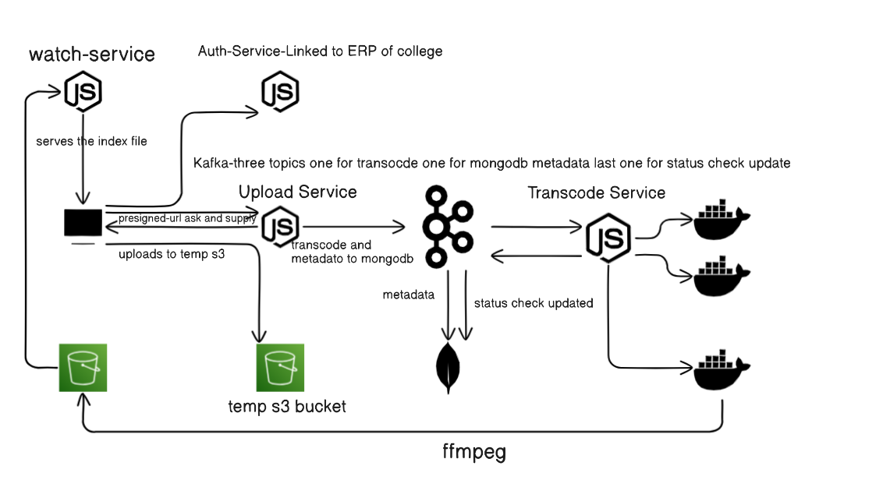

# IIITA-flix

IIITA-flix is a microservices-based video streaming platform designed for the students of IIITA (Indian Institute of Information Technology, Allahabad). The platform allows students to securely upload, watch, and manage their videos using a distributed architecture that leverages AWS, Kafka, and MongoDB.

## 📁 Project Structure

This project is divided into several microservices, each responsible for a specific function:

1. **Frontend Client:** A React-based client that interacts with backend services.
2. **Auth Service:** Handles user authentication using Flask and Node.js for JWT token generation.
3. **Upload Service:** Manages video uploads, stores metadata in MongoDB, and sends Kafka events.
4. **Transcoder Service:** Consumes Kafka events, transcodes videos using FFmpeg, and uploads them to AWS S3.
5. **Watch Service:** Serves pre-signed URLs for video playback using HLS streaming.

---
## 📦 Technology Stack

  *  Frontend: React, Axios, React Router
  *  Backend: Node.js, Express, Flask
  *  Database: MongoDB Atlas
  *  Messaging: Kafka (kafkajs)
  *  Cloud: AWS S3, ECS, EC2
  *  Transcoding: FFmpeg in Docker container
  *  Authentication: JWT tokens, ERP validation

## 🌐 Microservices Overview

### 1. Frontend Client (React)

- Path: `IIITA--flix-`
- Port: `3000`
- Description: The React client provides the user interface for uploading, watching, and managing videos. User authentication is handled via JWT tokens stored in cookies.

---

### 2. Auth Service

- Repository: [iiita-flix-authservice](https://github.com/jot-s-bindra/iiita-flix-authservice)
- Flask Service (Port: `5112`): Validates ERP credentials and issues JWT tokens.
- Node.js Service (Port: `4000`): Verifies JWT tokens and manages token-based authentication.

**Endpoints:**
- **POST** `/api/student/details` – Authenticate user and issue JWT token.
- **POST** `/api/auth/token` – Generate JWT token using UID.
- **GET** `/api/auth/verify/:uid` – Verify JWT token and match UID.

---

### 3. Upload Service

- Repository: [IIITA-flix-uploadservice](https://github.com/jot-s-bindra/IIITA-flix-uploadservice)
- Port: `5000`
- Description: This service handles video uploads using AWS S3 pre-signed URLs, saves metadata in MongoDB, and sends Kafka events to trigger transcoding.

**Kafka Topics:**
- `video-uploaded-to-temp-db` – Triggered when a video is uploaded.
- `video-uploaded-to-temp-transcode` – Notifies the Transcoder Service.
- `transcoder-status-update` – Receives transcoding status updates.

**Endpoints:**
- **POST** `/api/upload-url` – Generate pre-signed URL for video upload.
- **POST** `/api/upload-success` – Notify service of a successful upload.
- **GET** `/api/videos` – Retrieve all transcoded videos.

---

### 4. Transcoder Service

- Repository: [iiita-flix-transcoder-service](https://github.com/jot-s-bindra/iiita-flix-transcoder-service)
- Port: Managed using AWS ECS
- Description: Consumes Kafka events, transcodes videos using FFmpeg, uploads HLS segments to AWS S3, and sends status updates to Upload Service.

**Kafka Topics:**
- **Consume:** `video-uploaded-to-temp-transcode`
- **Produce:** `transcoder-status-update`

**Process:**
1. Download video from AWS S3 using a pre-signed URL.
2. Transcode video using FFmpeg into HLS format.
3. Upload HLS segments and `index.m3u8` file to AWS S3.
4. Send a status update to the Upload Service via Kafka.

---

### 5. Watch Service

- Repository: [iiita-flix-watch_service](https://github.com/jot-s-bindra/iiita-flix-watch_service)
- Port: `7000`
- Description: Serves pre-signed URLs for HLS video playback.

**Endpoints:**
- **GET** `/api/watch/:userId/:title` – Generate a pre-signed URL for video playback.

---

## 🧩 Workflow

1. **Authentication:**
   - User logs in via ERP credentials.
   - Flask service validates credentials and Node.js service issues a JWT token.
   - JWT token is stored in cookies with `HttpOnly` and `SameSite=Lax`.

2. **Video Upload:**
   - User uploads a video using a pre-signed URL provided by the Upload Service.
   - Upload Service saves video metadata in MongoDB and triggers Kafka events.

3. **Video Transcoding:**
   - Transcoder Service consumes Kafka events, transcodes the video using FFmpeg, and uploads HLS segments to AWS S3.

4. **Video Playback:**
   - Watch Service provides pre-signed URLs for HLS playback.
   - React client uses HLS.js to play the video.

---

## 🗂️ File Structure

```plaintext
IIITA-flix
├── Frontend (React)
├── Auth Service
│   ├── Flask (app.py)
│   └── Node.js (index.js)
├── Upload Service
│   ├── Kafka Consumers
│   ├── MongoDB Models
│   └── AWS S3 Integration
├── Transcoder Service
│   ├── FFmpeg Container
│   └── AWS ECS Task
└── Watch Service
    ├── MongoDB Models
    └── AWS S3 Pre-Signed URLs
```
## ⚙️ Environment Variables

### Upload Service (`.env`)

```plaintext
AWS_ACCESS_KEY_ID=your_access_key_here
AWS_SECRET_ACCESS_KEY=your_secret_key_here
AWS_REGION=your_region_here
S3_TEMP_BUCKET_NAME=your_temp_bucket_name
S3_BUCKET_NAME=your_main_bucket_name
KAFKA_BROKER=your_kafka_broker_here
MONGODB_URI=your_mongodb_uri_here
```
### Auth Service (.env)
```plaintext
JWT_SECRET=your_jwt_secret_here
JWT_EXPIRES_IN=2h
COOKIE_NAME=auth_token
```
## 🚀 Deployment
### 1. Deploy Kafka using Docker:
```plaintext
docker run -p 2181:2181 zookeeper
docker run -p 9092:9092 -e KAFKA_ZOOKEEPER_CONNECT=<PRIVATE_IP>:2181 confluentinc/cp-kafka
```
### 2. Start Services using PM2:
```plaintext
# Auth Service
cd iiita-flix-authservice
pm2 start "venv/bin/python3 app.py" --name "flask-auth-service"
cd jwt-service
pm2 start "node index.js" --name "node-jwt-service"

# Upload Service
cd IIITA-flix-uploadservice
pm2 start server.js --name "upload-service"

# Watch Service
cd iiita-flix-watch_service
pm2 start server.js --name "watch-service"

# Frontend Client
cd IIITA--flix-
npm run build
serve -s dist -l 3000
pm2 start "serve -s dist -l 3000" --name "frontend-client"

# Save PM2 Configuration
pm2 save
pm2 startup
```
## 💡 Key Features

✔️ Microservices architecture with Kafka for asynchronous communication
✔️ Secure file uploads using AWS S3 pre-signed URLs
✔️ Video transcoding using FFmpeg and AWS ECS
✔️ HLS video playback using HLS.js
✔️ MongoDB for storing video metadata
✔️ User authentication using JWT tokens

